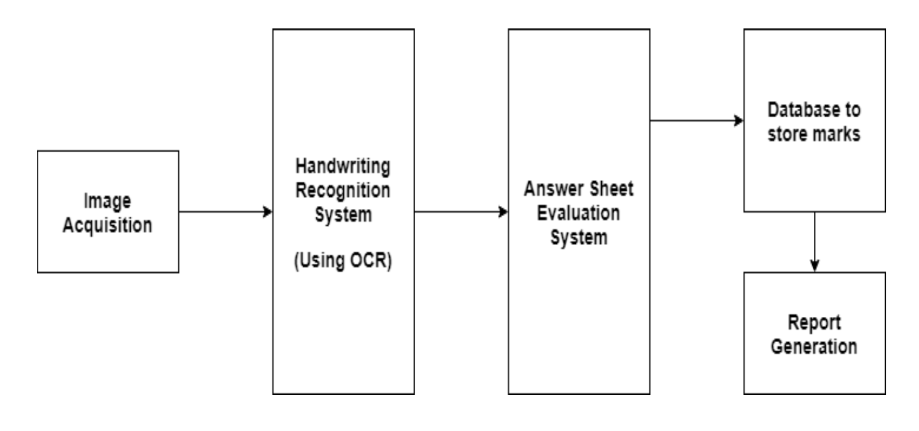

# Automated Paper Evaluation
[]()

A machine learning project to help teachers/lecturers/professors to evaluate examination papers using optical character recognition to extract text from written answers, natural language processing to check similarities with the actual answer, grammar and other criteria's to allocate grades to the students.

### Overview:
* This project provides interface to input student answer sheets and get progress reports for each individual students in the end. Calculates the grades and reports internally.

* As there will be n students in a class and every month there will be exams and most of the lecturere's times goes on evaluation of papers.

* By this project they can make use of thier time more efficiently and focus on teaching and mentoring the students more. 

## System Design:

<div align="center">
 
 <br>
 <br>
 
</div>

Usage
-----

```
You might have to install Anaconda for python. 
Respective python libraries specified in requirements.txt file.
Android Studio for Android.
VScode for Web App.
MySQL for DataBase.
```

## Which technologies?

* **Machine Learning:** Image Processing: [Tessaract OCR](https://github.com/tesseract-ocr/tesseract), Natural Language Processing: [NLTK](https://www.nltk.org/)
* **Front-end Android :** *Java, Kotlin*
* **Front-end WEB :** *JavaScript*
* **Back-end API:** *Python*
* **Database**: *SQL* 

Thanks you for the creators/contributors of these libraries, you made our work efficient.


License
=======

    Copyright 2020 Kashyap Bhat

    Licensed under the Apache License, Version 2.0 (the "License");
    you may not use this file except in compliance with the License.
    You may obtain a copy of the License at

       http://www.apache.org/licenses/LICENSE-2.0

    Unless required by applicable law or agreed to in writing, software
    distributed under the License is distributed on an "AS IS" BASIS,
    WITHOUT WARRANTIES OR CONDITIONS OF ANY KIND, either express or implied.
    See the License for the specific language governing permissions and
    limitations under the License.

